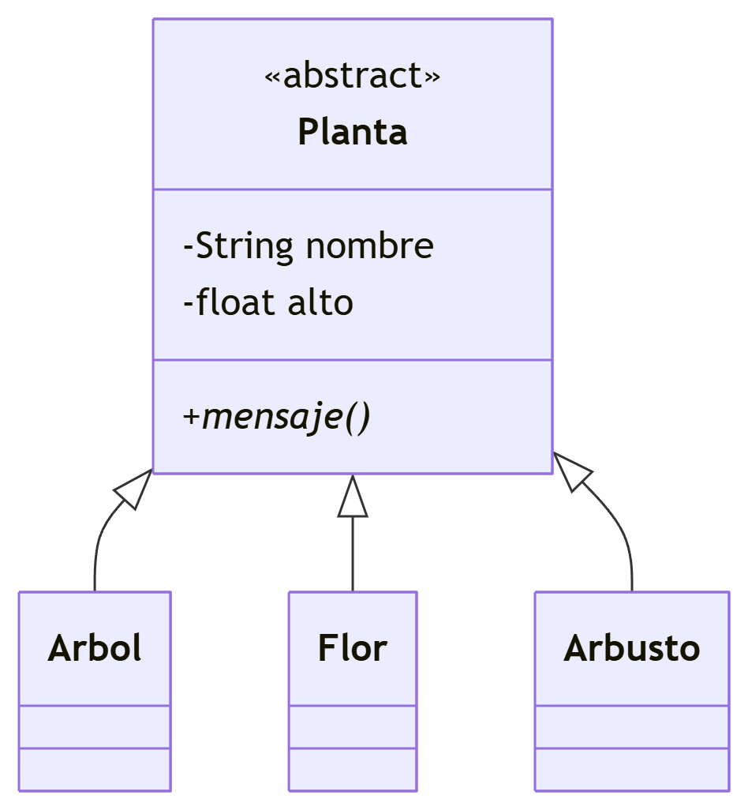

# 🌱 Sistema de Clasificación de Plantas en Java

Proyecto que demuestra los principios de **Programación Orientada a Objetos (POO)** mediante un sistema jerárquico de clasificación botánica.

---

## 📋 Tabla de Contenidos
- [🏗️ Estructura del Proyecto](#️-estructura-del-proyecto)
- [⚙️ Requisitos](#️-requisitos)
- [🧠 Conceptos Implementados](#-conceptos-implementados)
- [📐 Diagrama de Clases](#-diagrama-de-clases)
- [💻 Salida del Programa](#-salida-del-programa)
- [📚 Lecciones Aprendidas](#-lecciones-aprendidas)
- [📜 Licencia](#-licencia)

---
## Estructura del proyecto

```text
src/
├── Planta.java # Clase abstracta base
├── Arbol.java # Representa árboles (hereda de Planta)
├── Flor.java # Representa flores (hereda de Planta)
├── Arbusto.java # Representa arbustos (hereda de Planta)
└── Implementacion.java # Punto de entrada principal
```

---

## ⚙️ Requisitos
- **JDK 8** o superior
- IDE (IntelliJ IDEA recomendado) o línea de comandos

---

🧠 Conceptos Implementados
Concepto	Ejemplo en el Código
Herencia	class Arbol extends Planta
Polimorfismo	Método mensaje() en cada subclase
Clase Abstracta	abstract class Planta
Encapsulamiento	Atributos privados + getters/setters

📐 Diagrama de Clases


💻 Salida del Programa
Hola soy un árbol
[Detalles del árbol...]
---------------------------------------------
Hola soy una flor
[Detalles de la flor...]
---------------------------------------------
Hola soy un arbusto
[Detalles del arbusto...]
📚 Lecciones Aprendidas

Diferencias entre métodos public y private

Cómo usar @Override para sobrescritura de métodos

Importancia de los modificadores de acceso

Ventajas de usar clases abstractas

📜 Licencia

Este proyecto está bajo licencia MIT.
Consulta el archivo LICENSE para más detalles.

⌨️ Desarrollado con ❤️ por Jorge Jayr Fonseca Ramírez usando Java + IntelliJ IDEA
